# Finance Tracker API 📊  
Production‑Ready FastAPI Backend with AWS ECS Fargate & Terraform

A lightweight, modular, and production‑ready **FastAPI** backend for tracking personal expenses — fully containerized with **Docker** and deployed to **AWS ECS Fargate** using **Terraform**.

This project demonstrates real‑world DevOps practices:
- Infrastructure as Code (**Terraform**)
- Containerization (**Docker**)
- Cloud deployment (**AWS ECS Fargate + ALB + RDS**)
- Secure VPC networking
- Logs and observability with **CloudWatch**
- CI/CD‑ready architecture

---

## 📚 Table of Contents

- [Built With](#-built-with)
- [Features](#-features)
- [Tech Stack](#-tech-stack)
- [High‑Level Architecture](#-high-level-architecture)
- [Project Structure](#-project-structure)
- [Authentication Flow](#-authentication-flow)
- [API Endpoints](#-api-endpoints)
- [Example cURL Commands](#-example-curl-commands)
- [Running Locally (Docker)](#-running-locally-docker)
- [Running Locally (without Docker)](#-running-locally-without-docker)
- [Environment Variables](#-environment-variables)
- [AWS Infrastructure (Terraform)](#-aws-infrastructure-terraform)
- [Deploying to AWS](#-deploying-to-aws-terraform--ecs-fargate)
- [Screenshots](#-screenshots)
- [Troubleshooting](#-troubleshooting--finance-calculator-api-aws-ecs-ecr-vpc)
- [AWS Resource Cleanup / Shutdown Guide](#-aws-resource-cleanup--shutdown-guide)
- [Cost Optimization Tips](#-cost-optimization-tips-aws)
- [License](#-license)

---

## 🧰 Built With


---

## 🚀 Features

- **JWT‑based authentication** (register + login)  
- **CRUD operations** for expenses  
- **SQLite** locally, **PostgreSQL (RDS)** in production  
- Modular **FastAPI** architecture (api/core/models/schemas)  
- **Dockerfile** + **docker‑compose** for local containerized runs  
- Interactive **Swagger UI** at `/docs`  
- Production deployment on **AWS ECS Fargate**  
- Infrastructure managed with **Terraform**  

---

## 🛠️ Tech Stack

### Backend
- FastAPI  
- Python 3.11  
- SQLAlchemy ORM  
- Pydantic v2  
- Uvicorn  

### Infrastructure
- Terraform  
- AWS ECS Fargate  
- AWS ECR  
- AWS RDS (PostgreSQL)  
- AWS Application Load Balancer (ALB)  
- AWS VPC (public + private subnets)  
- AWS CloudWatch Logs  
- IAM roles & policies  

---

## 🏗️ High‑Level Architecture

    Internet
        |
    Application Load Balancer (HTTP :80, public subnets)
        |
    ECS Fargate Task (FastAPI container, private subnets)
        |
    RDS PostgreSQL (private subnets)

VPC:
- Public subnets: ALB, NAT Gateway  
- Private subnets: ECS tasks, RDS  
- Security groups: least‑privilege access between ALB → ECS → RDS  

---

## 📂 Project Structure

    finance-tracker-api/
    │
    ├── app/
    │   ├── api/
    │   │   ├── auth.py
    │   │   └── expenses.py
    │   ├── core/
    │   │   ├── auth.py
    │   │   ├── database.py
    │   │   └── security.py
    │   ├── models/
    │   ├── schemas/
    │   ├── utils/
    │   └── main.py
    │
    ├── infra/                  # Terraform IaC
    │   ├── main.tf             # Root module wiring
    │   ├── vpc.tf              # VPC, subnets, routes, IGW, NAT
    │   ├── ecs.tf              # ECS cluster, task definition, service
    │   ├── rds.tf              # RDS PostgreSQL instance
    │   ├── security.tf         # Security groups, IAM roles/policies
    │   ├── variables.tf        # Input variables
    │   ├── outputs.tf          # ALB DNS, RDS endpoint, etc.
    │   ├── terraform.tfvars.example
    │   └── ...
    │
    ├── Dockerfile
    ├── docker-compose.yml
    ├── .gitignore
    └── README.md

---

## 🔐 Authentication Flow

1. Register a user  
2. Log in to receive an `access_token`  
3. Use the token in the `Authorization` header:

    Authorization: Bearer <your_token_here>

---

## 📌 API Endpoints

### Auth

| Method | Endpoint         | Description          |
|--------|------------------|----------------------|
| POST   | /auth/register   | Register a new user  |
| POST   | /auth/login      | Login and get JWT    |

### Expenses

| Method | Endpoint          | Description               |
|--------|-------------------|---------------------------|
| POST   | /expenses/        | Create an expense         |
| GET    | /expenses/        | Get all expenses          |
| GET    | /expenses/{id}    | Get a single expense      |
| PUT    | /expenses/{id}    | Update an expense         |
| DELETE | /expenses/{id}    | Delete an expense         |

---

## 🧪 Example cURL Commands

### Create an expense

    curl -X POST "http://127.0.0.1:8000/expenses/" \
      -H "Content-Type: application/json" \
      -H "Authorization: Bearer <token>" \
      -d '{
        "title": "Groceries",
        "description": "Weekly food shopping",
        "amount": 45.58,
        "category": "Food"
      }'

### Get all expenses

    curl -X GET "http://127.0.0.1:8000/expenses/" \
      -H "Authorization: Bearer <token>"

---

## 🐳 Running Locally (Docker)

    docker-compose up --build

---

## 🧭 Running Locally (without Docker)

    uvicorn app.main:app --reload

---

## ⚙️ Environment Variables

### Local
- `DATABASE_URL` — defaults to SQLite (e.g. `sqlite:///./finance.db`)  
- `JWT_SECRET_KEY`  
- `JWT_ALGORITHM` (e.g. `HS256`)  
- `ACCESS_TOKEN_EXPIRE_MINUTES`  

### Production (AWS)
- `DATABASE_URL` — RDS PostgreSQL connection string  
- `JWT_SECRET_KEY` — stored securely (e.g. SSM / Secrets Manager)  
- `JWT_ALGORITHM`  
- `ACCESS_TOKEN_EXPIRE_MINUTES`  

---

## ☁️ AWS Infrastructure (Terraform)

### VPC & Networking
- VPC with CIDR block  
- Public subnets (ALB, NAT Gateway)  
- Private subnets (ECS tasks, RDS)  
- Internet Gateway + NAT Gateway  
- Route tables and associations  

### ECS & ALB
- ECS Cluster  
- Task Definition (FastAPI container)  
- ECS Service (Fargate)  
- Application Load Balancer (HTTP 80)  
- Target Group + Listener  
- Health checks for FastAPI (e.g. `/docs` or `/`)  

### Database (RDS)
- PostgreSQL instance in private subnets  
- Security group allowing traffic only from ECS tasks  
- Outputs for RDS endpoint  

### Security & IAM
- Security groups:
  - ALB → ECS  
  - ECS → RDS  
- IAM roles and policies for:
  - ECS task execution (ECR pull, CloudWatch logs)  
  - ECS task role (app‑level permissions if needed)  

### Variables & Outputs
- `variables.tf` — input variables (region, VPC CIDR, DB config, etc.)  
- `outputs.tf` — ALB DNS name, RDS endpoint, etc.  
- `terraform.tfvars.example` — template for real `terraform.tfvars` (not committed)  

---

## 🚀 Deploying to AWS (Terraform + ECS Fargate)

> Ensure `terraform.tfvars` is created locally (not committed) based on `terraform.tfvars.example`.

### 1. Initialize Terraform

    cd infra
    terraform init

### 2. Preview the infrastructure

    terraform plan

### 3. Apply the infrastructure

    terraform apply

This will create:
- VPC, subnets, routes, gateways  
- ECS cluster, ALB, target group, listener  
- RDS PostgreSQL instance  
- Security groups, IAM roles  
- CloudWatch log groups  

### 4. Build & Push Docker Image to ECR

From project root:

    docker build -t finance-api .
    docker tag finance-api:latest <aws_account_id>.dkr.ecr.<region>.amazonaws.com/finance-api:latest
    docker push <aws_account_id>.dkr.ecr.<region>.amazonaws.com/finance-api:latest

### 5. ECS Service

- ECS Fargate service is configured to pull the image from ECR  
- When the new image tag is used, ECS deploys a new task revision  

### 6. Access the API via ALB

Use the ALB DNS name from Terraform outputs:

    http://<alb_dns_name>/docs

---

## 📸 Screenshots 

### Screenshot 01 — API Overview (POST /auth/register)
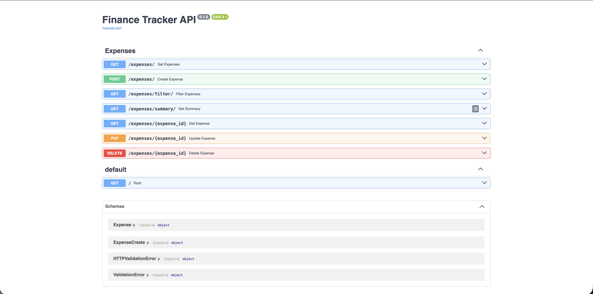

### Screenshot 02 — Docker Compose Build + Startup Logs
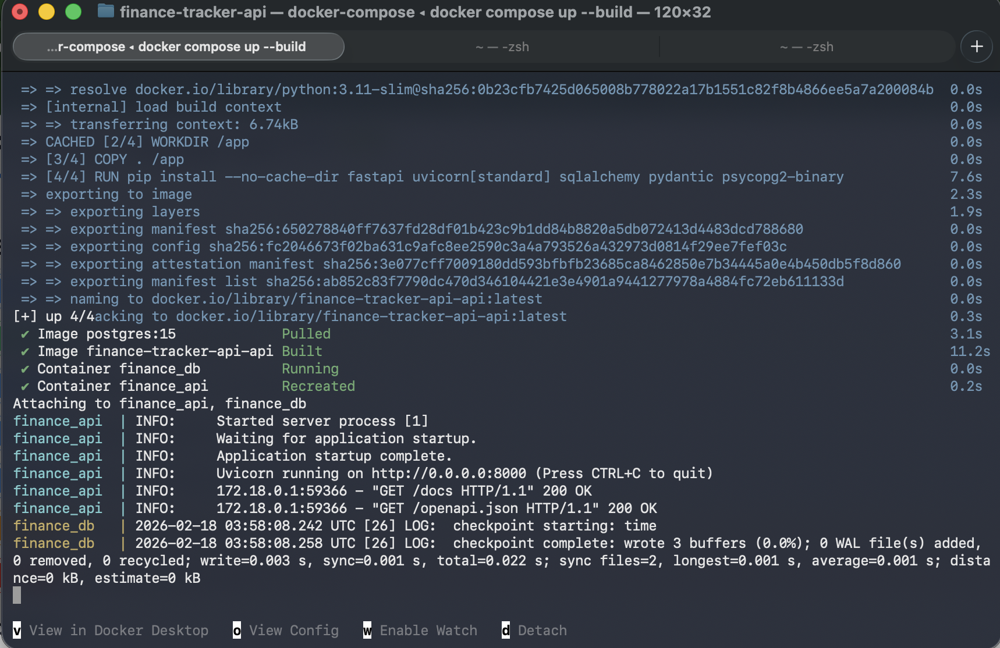

### Screenshot 03 — API Overview (After Authentication Added)
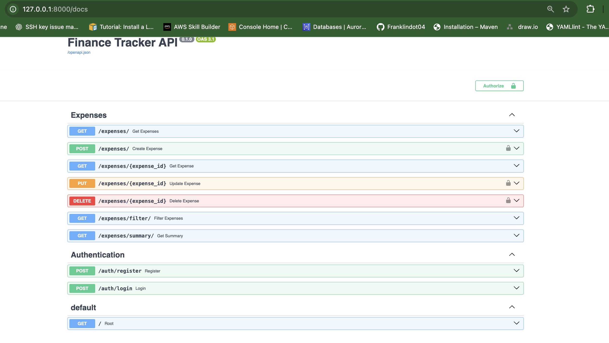

### Screenshot 04 — Successful User Registration (200 OK)
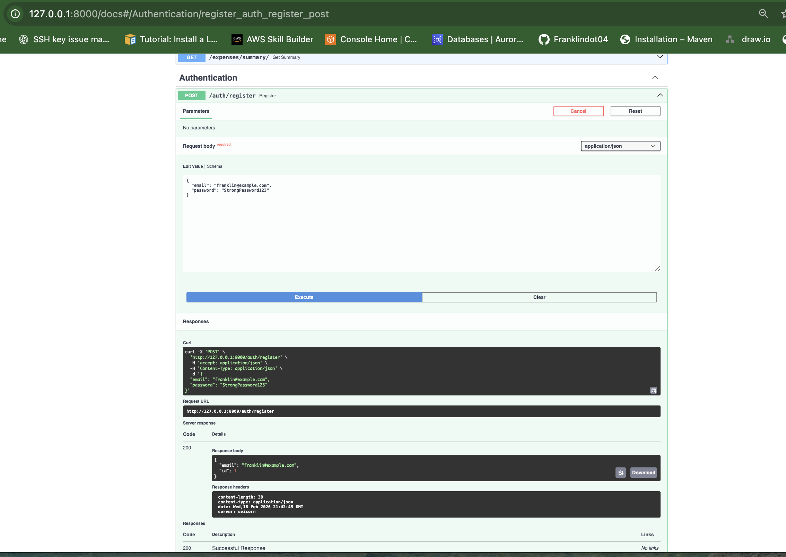

### Screenshot 05 — Successful Login (JWT Token Returned)
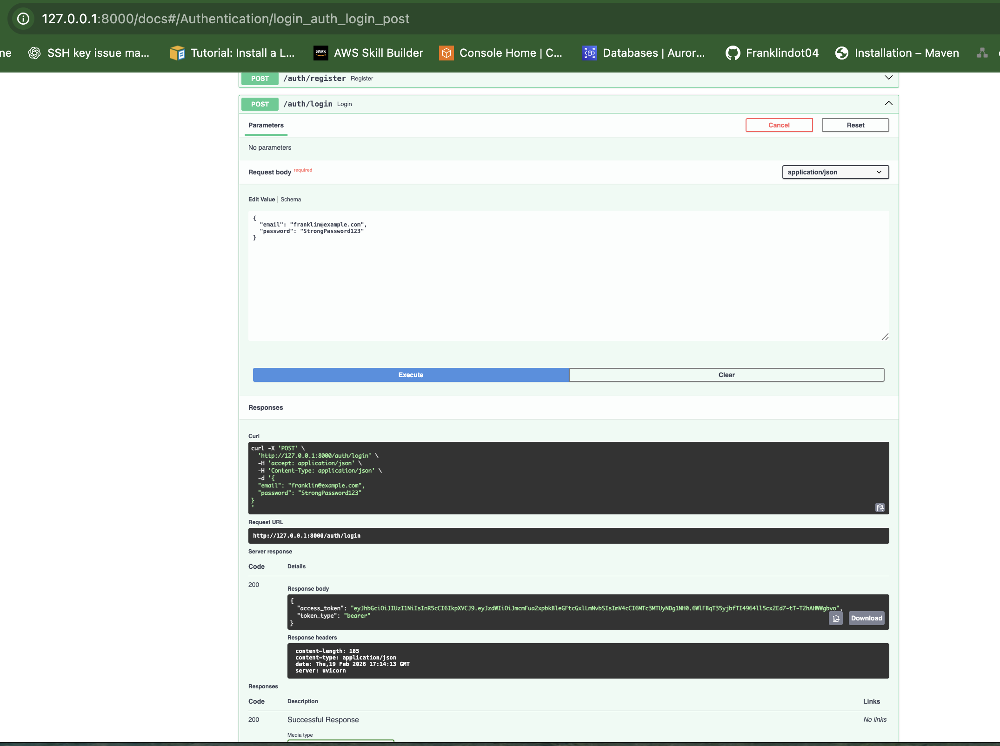

### Screenshot 06 — Successful POST (Create Expense)
Command used:
```bash
    curl -X POST "http://127.0.0.1:8000/expenses/" \
    -H "Authorization: Bearer <your_jwt_token>"
```
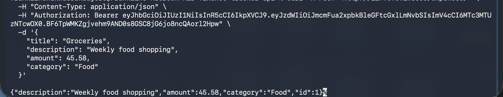

### Screenshot 07 — Successful GET (Retrieve Expenses)
Command used:
```bash
    curl -X GET "http://127.0.0.1:8000/expenses/" \
    -H "Authorization: Bearer <your_jwt_token>"
```
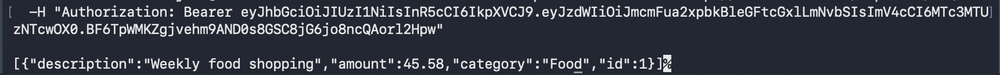

### Screenshot 08 — ECS Service Overview (Cluster, Service, Desired/Running Count)
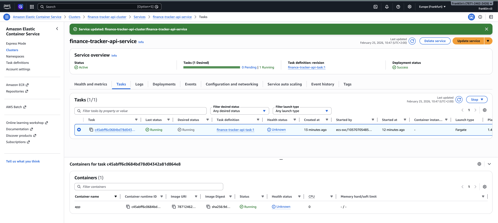

### Screenshot 09 — ALB Target Group Showing Healthy ECS Task
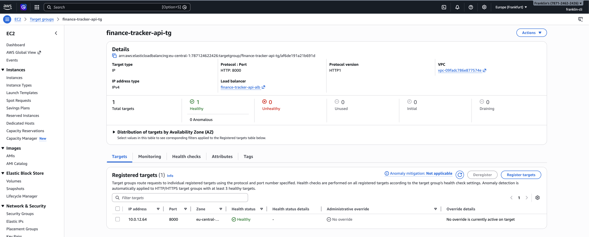

### Screenshot 10 — FastAPI Documentation Served Through ALB
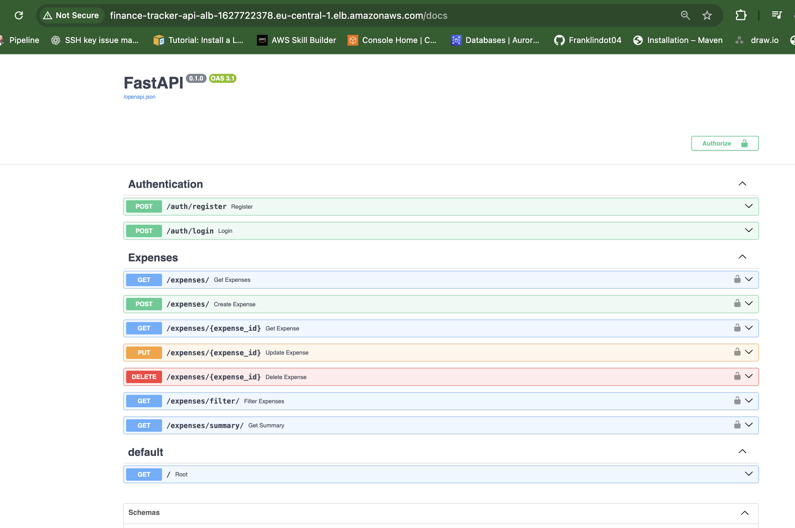

### Screenshot 11 — Terraform Project Structure
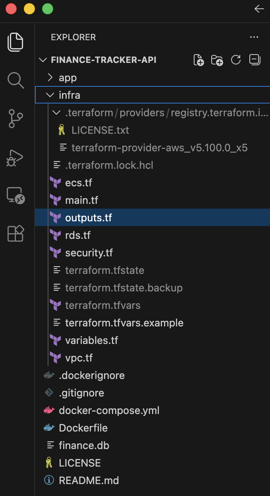

### Screenshot 12 — Terraform Apply Output
Command used:
```bash
    terraform apply -refresh-only
```
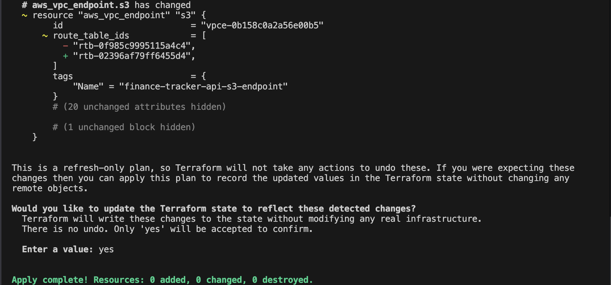

### Screenshot 13 — CloudWatch Logs (ECS Task Output)
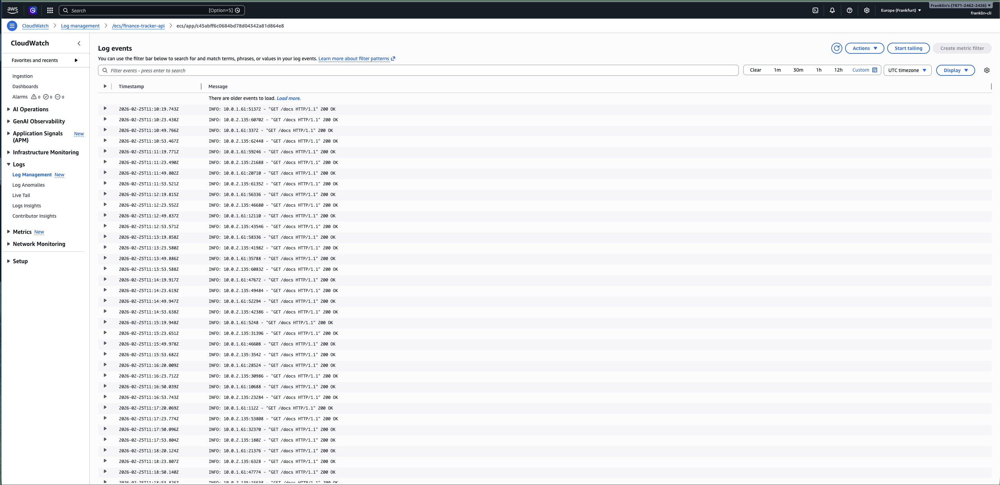

---

## 🔒 Security Considerations

- No secrets committed  
- `.gitignore` excludes:
  - `terraform.tfvars`
  - `terraform.tfstate` / `terraform.tfstate.backup`
  - `.terraform/`
  - `.terraform.lock.hcl`
  - `__pycache__/`, `*.pyc`
  - `.DS_Store`
  - `.vscode/`
  - `finance.db`
- RDS in private subnets, not publicly accessible  
- ECS tasks communicate with RDS via security groups  
- ALB is the only public entry point  

---

## 🌱 Future Improvements

- Add categories & budgets  
- Add monthly reports and analytics  
- Add user‑specific dashboards  
- Add CI/CD pipeline (GitHub Actions → ECS Fargate)  
- Add CloudWatch alarms + autoscaling policies  
- Add WAF in front of ALB  

---

## 🛠️ Troubleshooting — Finance Calculator API (AWS ECS, ECR, VPC)

### ❗ ECS `CannotPullContainerError` — Root Cause & Fix

**Symptom**  
ECS task fails with:

```
CannotPullContainerError: failed to copy: httpReadSeeker: failed open: dial tcp <ECR-IP>:443: i/o timeout
```

The task remains in **STOPPED** state and never reaches **RUNNING**.

---

### **Root Cause**

When running ECS Fargate tasks in **private subnets**, the task must access:

- ECR API endpoint  
- ECR DKR endpoint  
- **S3 Gateway endpoint** (required for downloading image layers)

Even if the ECR endpoints are correct, the task **cannot pull the image** unless the **S3 endpoint is attached to the same route table** used by the private subnets.

In this project:

- Private subnets used route table:  
  **`rtb-02396af79ff6455d4`**
- But the S3 endpoint was attached to a different route table:  
  **`rtb-0f985c9995115a4c4`** (public)

This prevented the ECS task ENI from reaching S3, causing the image pull to fail.

---

### **Fix**

Attach the S3 VPC endpoint to the private route table:

1. Go to **VPC → Endpoints**
2. Open the S3 endpoint (`com.amazonaws.<region>.s3`)
3. Click **Manage route tables**
4. Select the private route table:  
   **`rtb-02396af79ff6455d4`**
5. Save changes
6. Force a new ECS deployment

After this change, the ECS task could reach S3, download image layers, and start successfully.

---

### **Why This Matters**

ECR stores **image metadata** in ECR, but stores **image layers** in S3.  
Without S3 access, the ECS task cannot download the actual container filesystem.

This is one of the most common — and most confusing — ECS networking issues.

## 🧹 AWS Resource Cleanup / Shutdown Guide  
To prevent unnecessary AWS charges, make sure all infrastructure created for this project is fully destroyed. This section outlines the exact steps to safely shut down every component deployed with Terraform and AWS ECS.

---

### ✅ 1. Destroy All Terraform‑Managed Resources  
Terraform created the majority of your infrastructure, including:

- VPC, subnets, route tables  
- NAT Gateway (one of the most expensive resources)  
- ECS Cluster, Task Definitions, Services  
- Application Load Balancer (ALB)  
- RDS PostgreSQL instance  
- Security groups, IAM roles  
- CloudWatch log groups  

From the `infra/` directory:

```bash
terraform destroy
```

This command removes **all** Terraform‑managed AWS resources.  
Wait for the destroy process to complete fully before moving on.

---

### ✅ 2. Delete ECR Images (Not Managed by Terraform)  
Terraform does **not** delete ECR repositories or images.  
To avoid storage charges:

1. Go to **ECR → Repositories**
2. Open your repository (e.g., `finance-api`)
3. Select all images → **Delete**
4. Then delete the repository itself

---

### ✅ 3. Delete CloudWatch Log Groups (If Terraform Didn’t Create Them)  
ECS automatically creates log groups if they don’t exist.

To remove them:

1. Go to **CloudWatch → Logs → Log groups**
2. Search for:
   - `/ecs/finance-api`
   - `/aws/ecs/containerinsights/...`
3. Delete them

---

### ✅ 4. Verify No ECS Tasks or Services Are Running  
Even after `terraform destroy`, double‑check:

1. Go to **ECS → Clusters**
2. Ensure:
   - No clusters remain  
   - No services  
   - No running tasks  

If anything remains, delete it manually.

---

### ✅ 5. Delete Orphaned Network Interfaces (ENIs)  
Sometimes ECS or VPC endpoints leave ENIs behind.

To clean them:

1. Go to **EC2 → Network Interfaces**
2. Filter by **status: available**
3. Delete any ENIs related to:
   - ECS
   - VPC endpoints
   - Load balancers

---

### ✅ 6. Remove S3 Buckets (If You Created Any)  
If you used S3 for Terraform backend or storage:

1. Empty the bucket  
2. Delete the bucket  

---

### ✅ 7. Confirm NAT Gateway Is Gone  
NAT Gateways cost money **per hour**, even when idle.

After `terraform destroy`, verify:

1. Go to **VPC → NAT Gateways**
2. Ensure **none remain**

---

### 🟩 Final Check — Your AWS Account Should Be Clean  
After completing all steps, verify:

- No VPCs  
- No subnets  
- No ALBs  
- No ECS clusters  
- No RDS instances  
- No ECR repositories  
- No CloudWatch log groups  
- No ENIs  
- No NAT Gateways  

Your AWS bill should now drop to **near zero**.

## 💰 Cost Optimization Tips (AWS)

Running workloads on AWS can become expensive if resources are left running unintentionally. Below are practical, real‑world cost‑saving strategies that apply directly to this project’s architecture.

---

### 🟦 1. Prefer On‑Demand Fargate Tasks Only When Needed  
ECS Fargate charges per second. To reduce costs:

- Stop services when not actively testing  
- Use **Fargate Spot** for non‑critical workloads  
- Keep CPU/memory definitions minimal (e.g., 0.25 vCPU / 0.5 GB)

---

### 🟧 2. Avoid NAT Gateway Charges  
NAT Gateways cost **per hour + per GB**. They are one of the most expensive components in small projects.

To reduce costs:

- Use **VPC Endpoints** (S3, ECR API, ECR DKR) to avoid NAT traffic  
- Destroy NAT Gateway when not needed  
- For dev environments, consider **public subnets only** (no NAT)

---

### 🟩 3. Use Small RDS Instances or Replace with SQLite for Dev  
RDS instances incur:

- Hourly cost  
- Storage cost  
- Backup cost  

For development:

- Use **SQLite** locally  
- Use **RDS t3.micro** or **t4g.micro** for minimal cost  
- Turn off automatic backups for dev environments  
- Destroy RDS when not in use

---

### 🟪 4. Clean Up ECR Images Regularly  
ECR charges for storage. Over time, unused images accumulate.

Best practices:

- Delete old image tags  
- Enable **ECR lifecycle policies** (e.g., keep last 5 images)  
- Remove entire repositories when shutting down the project

---

### 🟫 5. Remove Unused CloudWatch Log Groups  
CloudWatch Logs charge per GB stored.

To reduce costs:

- Delete old log groups  
- Set retention policies (e.g., 7 or 14 days)  
- Avoid storing large debug logs in production


## 📄 License

This project is licensed under the **MIT License**.
